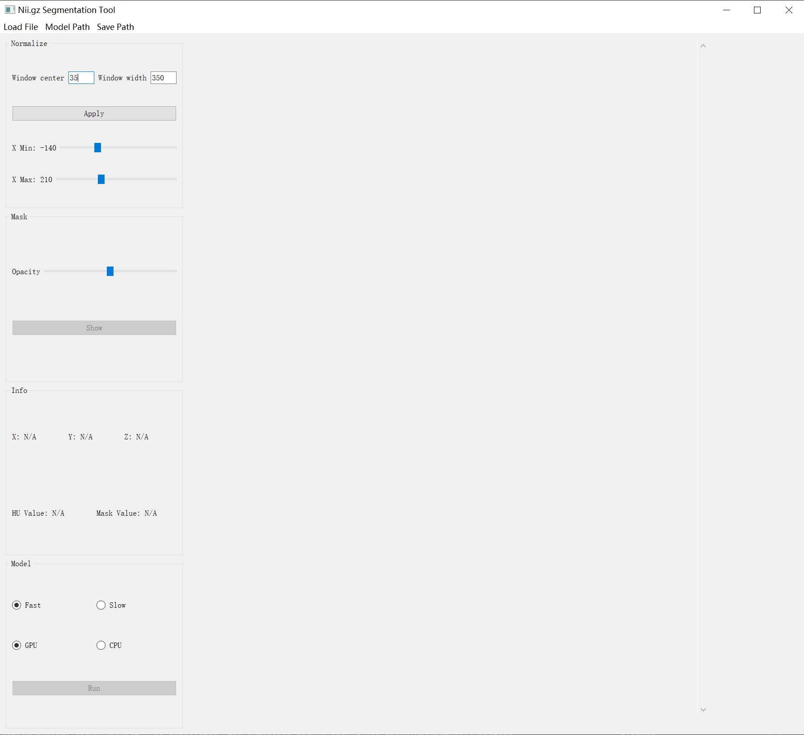

<!--
 * @Author: HaoZhi
 * @Date: 2024-12-23 17:25:29
 * @LastEditors: HaoZhi
 * @LastEditTime: 2024-12-24 10:25:12
 * @Description: 
-->



UI界面95%由Chatgpt完成，totalseg部分由[官方代码](https://github.com/wasserth/TotalSegmentator/tree/v1_bugfixes)修改而来，与我[之前重构的代码](https://github.com/haozhi1817/TotalSegmentator)基本一致。

1. 创建虚拟环境
```bash
conda create --name total_seg python=3.7
```
2. 安装依赖
```bash
conda install pytorch==1.12.1 torchvision==0.13.1 torchaudio==0.12.1 -c pytorch
pip install SimpleITK==2.1.0
pip install TotalSegmentator==1.5.7
pip install PyQt5==5.15.7
pip install sip==6.6.2
```
3. 运行代码
```bash
python totalseg_ui.py
```
4. 软件说明

* 加载 
  * 加载数据：仅支持.nii.gz数据输入
  * 设置模型路径：该路径下保存有Task251-Task256总计6个文件夹，这些文件夹均可以从根据[参考文件](https://github.com/wasserth/TotalSegmentator/blob/v1_bugfixes/totalsegmentator/libs.py#L92)下载
  * 设置保存路径：分割结果保存路径
* Normalize
  * 调整数据的窗宽窗位，可以选择手动输入窗宽窗位并点击Apply，也可以选择拖动HU_MIN与HU_MAX。
* Mask
  * 如果保存路径中存在nii.gz文件的分割结果(形式为_mask.nii.gz)，点击show按钮，即可显示分割结果，再次点击show按钮，隐藏显示结果。
  * 调整Opacity滑块可以调整分割结果的透明度。
* Info
  * 在图像上点击鼠标左键，即可显示十字线指示的坐标以及HU值。
  * 如果有分割结果显示，那么同时会显示分割结果的标签，
* Model
  * Mode: Fast/Slow分别对应使用3mm以及1.5mm spacing预测，前者更快，但是精度较低，后者更慢，但是精度较高
  * Device： GPU/CPU分别对应在GPU上还是在CPU上完成计算
  * 配置好模型路径后，点击run即可对数据进行分割，分割完成后，软件最下方会提示完成信息。